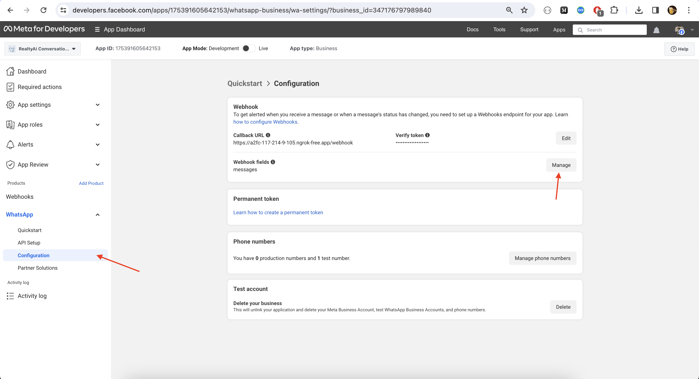

# Realtyai-bot
This is a conversation agent powered by OpenAI, Langchain, and Qdrant vector database.
The agent has access to three tools(currently): Web Search tool, RAG(Retrieval Augmented Generation) tool to answer questions from PDFs and links that you shared, and  Retrieval tool for those PDFs and links.


## Things you can do with the bot
### 1. Web Search 
You can ask the bot to Search or Lookup for specific queries by asking for it using prompts like "Search for tech specifications of IPAD 9th gen. Summarise your answer in 3 points." or "Lookup how Conversational Retrieval Agent Works in Langchain." Using keywords like 'Search' or 'Lookup' is recommended to incline the bot more into using the Web Search tool. The bot will retrieve webpages straight from the internet, scrape the contents of those webpages, and answer with any relevant infomations it manages to find. In the occasion where those keywords are omitted from the prompt, the bot will still use the search tool, if the prompt is related to current events or current state of the world.

### 2. Retreival Augmented Generation
In order to use this tool, we need to provide/share the bot with some resource/materials before prompting. This resource could be a PDF file or a link. Share atleast one resource first, preferably with a caption. **DO NOT write your prompt in the caption field of your media. The bot will not use it as a prompt or a question. It will simply use it as a filename, in case the file you shared is unnamed. !!!** The bot will take some time to process your document. It will inform you once it's done.

Once your document/link is properly proceessed, you can start asking questions from it. Using the keyword "Rag"(not case sensitive) is strongly recommended here to incline the bot to answer from the documents you shared. Some example prompts include "Rag about how to write a good letter of recommendation." or "Rag about the different components of Logistic Regression". You can also try prompts like "Answer from my documents about the different components of Logistic Regression" or "I shared some documents about Graduate School Talk before. What does it say about writing a good letter of recommendation.". 

### 3. File/URL Retrieval
This is another tool you can use to retrieve the files/URL that you shared back. Use keywords like "Retrieve" to trigger this tool. Example prompts include "Retrieve my file on logistic regression" of "Send me back my file on logistic regression". This could be useful tool for bookmarking links or files, and retrieving them through natural language.

# Running it on your system
## Prerequisites:
* [A Meta for developer account and Whatsapp Business app.](https://developers.facebook.com/docs/whatsapp/cloud-api/get-started)
* [A free instance of Qdrant Cloud Cluster.](https://qdrant.tech/documentation/cloud/quickstart-cloud/)
* Cohere API key.
* [⁠Ngrok installed on your system.](https://ngrok.com/docs/getting-started/)
* OpenAI API key.
* ⁠A working AWS account.
    - AWS access key id.
    - AWS secret access key.
    - An AWS S3 bucket created (to store user's media).
    - A DynamoDB table created (to store chat history).

## Steps:
* Create a clone of the repostitory on your local machine using the following command.
```
git clone https://github.com/sinngam-khaidem/Realtyai-Whatsapp-Conversation-Agent.git
```
* Inside the project directory, create a python virtual environment.<br>
For **Windows**,
```
python -m venv myvenv
```
For **Unix/MacOS**,
```
python3 -m venv myvenv
```
* Activate the python virtual environment we just created.<br>
For **Windows**,
```
myvenv\Scripts\activate
```
For **Unix/MacOS**,
```
source myvenv/bin/activate
```
* Install the required packages using the following command.
```
pip install -r requirements.txt
```
or
```
pip3 install -r requirements.txt
```
* Fill up the *env_template.txt* file and rename it to *.env*. Fill **VERIFY_TOKEN** field to "12345".

* Run the following command in the terminal to start the FastAPI server using Uvicorn.
```
uvicorn main:myapp --reload
```
The application will start running at port 8000.

* In a separate terminal tab, run the following ngrok command to expose **localhost 8000**, so that it can be accessed from Whatsapp Cloud API.
```
ngrok http 8000
```

* Copy the newly generated URL to clipboard and log into your Meta for Developer's account.

* Go to **My Apps**, open the Whatsapp Business App you created. The **API Setup** section will contain many useful informations.


* Send a test message to your own whatsapp number (after adding a Recipient Phone Number) by clicking on **Send Message** from the **Send message with the API field**. This will send a **Template Message** to your whatsapp number. You **must** reply something(anything) to the "Hello World" message you receive. This is a way to discourage spammers.

* Open **Configuration** from the left panel. From **Webhooks Field**, click **Manage**.


* Look for *messages* in the list and check it.<br>
Then click *Done*.


* Click on **Edit** from the **Callback URL** section.


* Paste the Ngrok URL we generated earlier to the **Callback URL** field.<br> 
Append '/webhook' after the URL.<br>
Fill "12345" in the **Verify Token** field. This has to be same with the **VERIFY_TOKEN** we set earlier.


* You must recieve a notification for successful webhook subscription on the terminal where Uvicorn is running. You will also receive a 200 OK response on the terminal where Ngrok is running.

